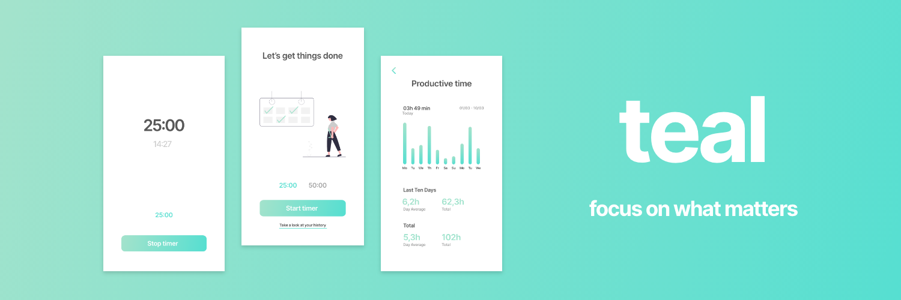

# teal

Focus on what matters

## Features

- Countdown based on the Pomodoro Technique
- 25:00 and 50:00 minutes option
- Dedicated start screen
- Dedicated break screen (5:00 / 10:00 minutes break)
- Productivity time tracking with history and average values

(Mobile optimized)

## About

**teal** is a productivity app based on the Pomodoro Technique. It is developed to help you focus on one of the most valuable resources - time. With its countdown, break and history features, this app provides you with all tools necessary to enhance your time management.
Your productivity app should not distract you from being productive. It should enhance it.

This objective was key in every step of the design and development process.
An integral part to fulfill this objective is the selection of color - mainly **teal**.

As [Canva](https://www.canva.com/colors/color-meanings/teal/) states:

> Teal combines the calming properties of blue with the renewal qualities of green.
> It is a revitalizing and rejuvenating color that also represents open communication and clarity of thought.

And due to the fact that it is such an essential ingredient of the app's recipe, I have called the app **teal**.

Last but not least, I would like to thank [unDraw](https://undraw.co/) for providing stunning illustrations truly open-source.

## All About Tech

### Create React App

This project was bootstrapped with [Create React App](https://github.com/facebook/create-react-app) and includes all common respective scripts.

### Installation

```zsh
$ git clone https://github.com/AmmNJ/capstone-project.git # HTTPS
$ git clone git@github.com:AmmNJ/capstone-project.git # SSH
$ cd capstone-project
$ npm i # installs packages in root folder and client folder
$ npm run dev # start in development mode
$ npm test # run tests
$ npm run storybook # start living styleguide
```

### Languages, Libraries and Tools Used

- React
- React-Router
- Styled Components
- Storybook
- PropTypes
- Node.js
- mongoDB Atlas
- mongoose
- Express
- Jest
- Testing Library
- Cypress
